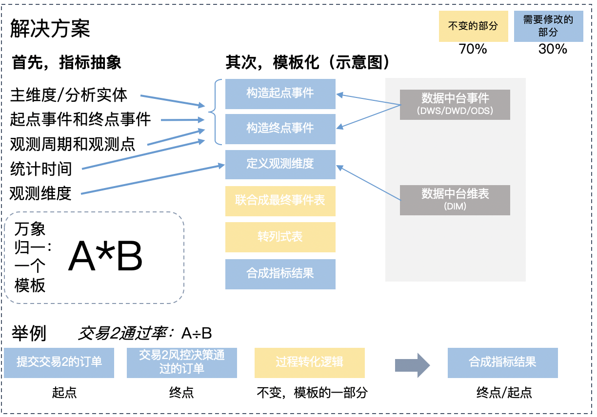
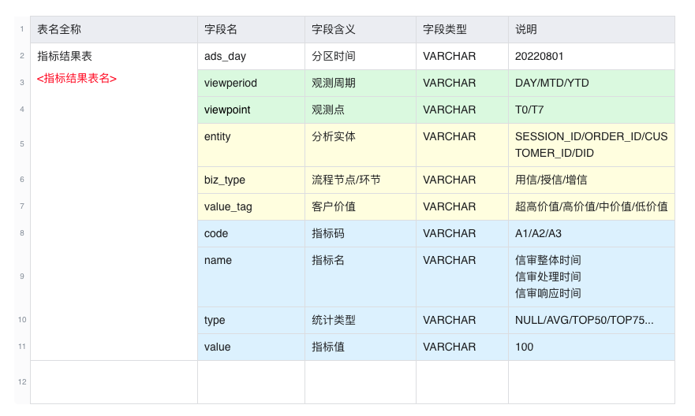

# 数据平台

## 标签配置化加工工具

本文讨论限定于离线标签。

**技术架构**

标签的结构非常固定，因此非常适合通过配置化的方式加工。

另外需要注意的是，通过配置化的方式加工数据，必然涉及对用户配置的 SQL 的合法性校验。一般目标执行引擎都会提供对应的 SQL 解析工具，比如 [presto-parser (Facebook Opensource, part of Presto)](https://mvnrepository.com/artifact/com.facebook.presto/presto-parser
)。

**存储方式**

一个公司的标签往往快速膨胀，如何设计一种非耦合的存储方式是关键，从而保证独立的执行，相互不影响。

## 指标配置化加工工具

本文讨论限定于离线指标。

**表达框架——指标技术体系**

**技术架构**

基于表达框架，指标可以做结构化抽象。如下图，可以抽象为起点、终点、观测维度，以及最后行转列，进而产出指标。

**存储方式**

指标和标签类似，也需要一种非耦合的设计，所以采用横向存储。

## 埋点配置化加工工具

本文讨论限定于离线埋点加工。

**技术架构**

埋点也即用户行为事件，结构相对来说也非常固定，因此也适合通过配置化的方式加工。

埋点配置化加工的核心点在于通过基础模板加代码生成，实现以配置化的方式加工埋点事件。基础模板是不变的部分，额外加的代码是变化的部分。

**存储方式**

采用横向存储。

## 自助数据分析工具

本文讨论限定于离线数据分析。