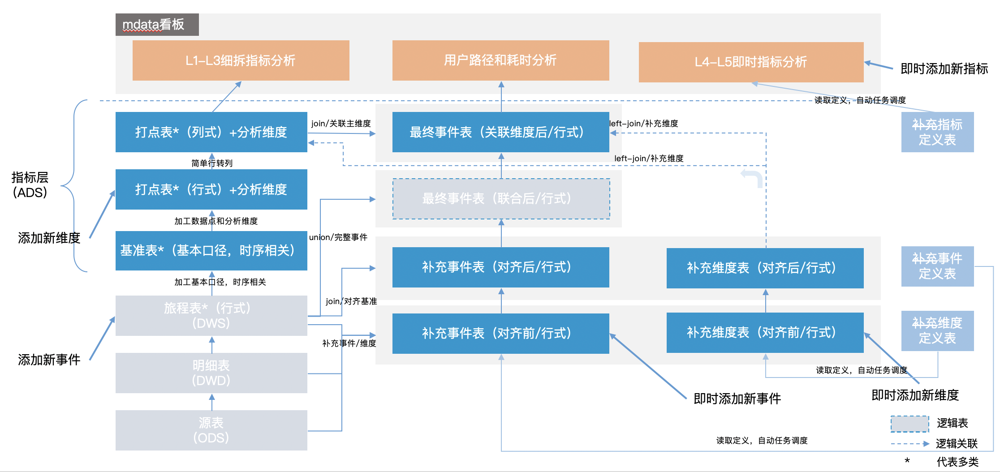
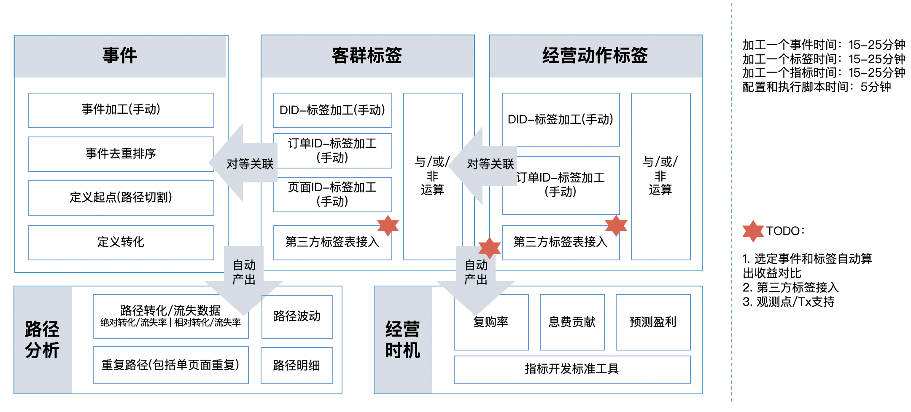

# 数据应用和服务

## 用户画像

本文讨论限定于离线标签。

通过全方位的标签，刻画一个用户的特征，即给用户画像，然后针对性的经营。

## 用户旅程

本文讨论限定于离线指标。

通过[事务表](DataWarehouse-batch-overview.md#事务表/事务事实表)的反应**完整业务变化事实**的特性，构建用户全生命周期旅程。

## 指标体系

指标作为衡量系统或业务健康度的晴雨表，在决策和紧急处置场景下发挥着重要作用。指标应用遵循[表达框架——指标技术体系](DataTools.md#指标配置化加工工具)，构建完善的指标体系。

## 标签体系

用户画像之外，还可以建立丰富的标签体系（业务人员负责）。从不同角度刻画用户以及用户的行为，进而针对性地经营。

## 数据服务——API

上述所讲的都是指数据的应用。数据可以通过广义上的 API 的方式（比如：HDFS 文件地址、Kafka 所代表的的消息队列、SQL 和 NoSQL 数据库等）对外提供服务。

## 数据服务——自助数据分析工具

除了 API 的方式，业务自助取数进行分析也是一种数据服务策略。本文讨论限定于离线数据分析。

自助分析工具（或多维分析工具）并不完善，不详述。

