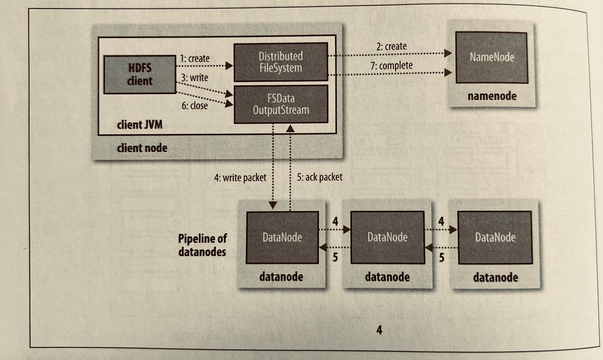
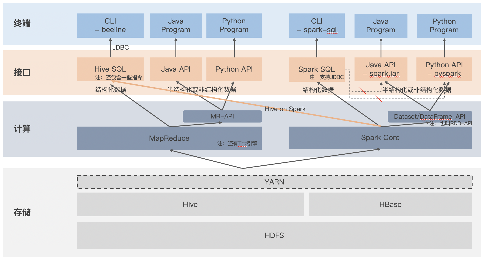
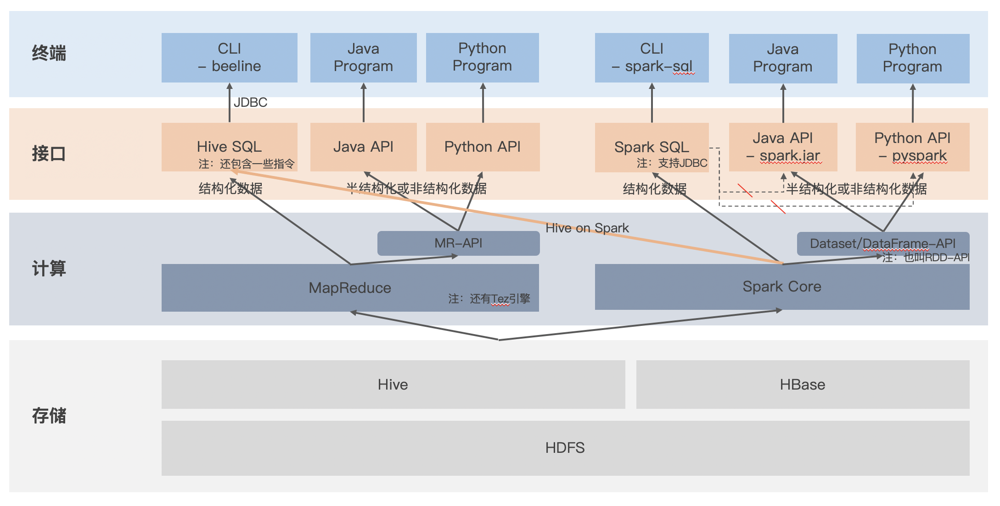
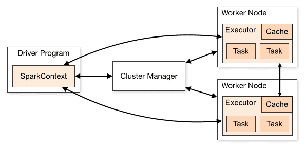
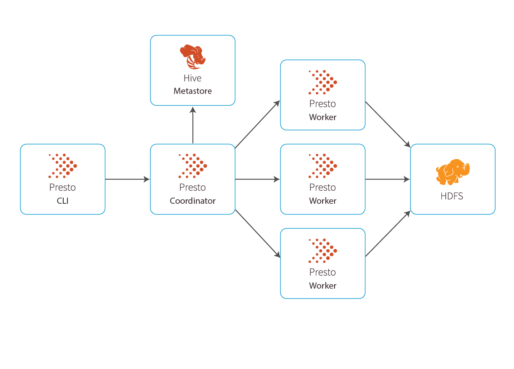

# 大数据技术

[[Hadoop](TechItself-batch.md#hadoop)]
[[MapReduce](TechItself-batch.md#mapreduce)]
[[HDFS](TechItself-batch.md#hdfs)]
[[YARN](TechItself-batch.md#yarn)]
[[Hive](TechItself-batch.md#hive)]
[[Spark](TechItself-batch.md#spark)]
[[Presto](TechItself-batch.md#presto)]
[[HBase](TechItself-batch.md#hbase)]
[[ZooKeeper](TechItself-batch.md#zookeeper)]
[[Flume/Sqoop/Datax](TechItself-batch.md#数据采集)]
[[OLAP](TechItself-batch.md#olap)]


## Hadoop

从狭义上来说, Hadoop 包括 HDFS（Hadoop Distributed File System） 和 MapReduce 两个组件。

### MapReduce

MapReduce(MR) 是一种用于分布式数据处理的编程模型。

#### MapReduce 数据流


如果是多个 Reduce 任务，需要通过算法确保相同 Key 的键值对数据传递给同一个 Reduce 任务。


#### 编程模型

MapReduce 是一种编程模型，但过于底层，要写出复杂的数据处理程序非常困难。Apache Pig 是基于 MR-API 的更高层次的编程抽象。但用的也不多，实际应用当中，更多的是使用 [Hive SQL](TechItself-batch.md#hive-sql) 执行 MapReduce 任务。

### HDFS

HDFS 是一个分布式的文件系统，可以运行在大规模廉价普通机器上。HDFS 适合一次写入，多次读取的场景，不像事务型数据系统，不支持修改。可以通过 YARN 管理这些分布式集群资源，YARN 在物理资源之上，提供一层抽象。

基于**数据本地化优化原则**（数据处理和计算应该尽可能地靠近数据源，以减少数据传输的开销和提高处理效率），Hadoop 把 MapReduce 程序转移到 HDFS 的各个分布式节点上去运行。但注意，数据本地化优化原则主要适用 Map 程序，因为 Reduce 程序的输入通常来自于所有 Map 程序的输出，必然会涉及跨节点数据传输。

注：HDFS 进程间通信采用的是 IDC 技术，而不是 [RMI](../JavaEE/RMI.md)。

#### 数据块

HDFS 上存储的文件被划分为多个分块（chunk），作为独立的存储单元。数据块通过**副本**的方式容错。

#### NameNode & DataNode

HDFS 也是主/从（M/S）架构。NameNode 是主节点（管理节点，只有一个），DataNode 是从节点（工作节点，有多个）。主节点管理文件系统的元数据，DataNode 受主节点的调度，存储或并检索数据块。

#### 主节点容错

NameNode 只有一个，需要容错（单点故障）。一般分布式系统通过"选主"重建主节点。HDFS 也采用了 ZK 的技术，在活动主节点之外，增加了备用主节点，并在活动主节点故障后启动备用主节点提供服务，来达到容错的目的。

HDFS 这一高可用机制称为 **Active/Standby** 架构，也是一种常用的解决单点故障的方法，只是实现上面 HDFS 可能有自己特殊的地方。

#### 主节点扩展

NameNode 只有一个，因此存储的元数据必然是有上限的。**联邦 HDFS** 允许添加多个 NameNode 来实现扩展，不详述。

#### HDFS（读）数据流


图中展示了，从客户端发出数据读取指令，到主节点寻址，再到从节点回传数据的整个过程。注意，与 Spark 不同，从节点的数据并不是通过主节点返回给客户端（Spark 是这样），而是直接和客户端交互传输给客户端。这也是数据计算（Spark 的场景）和数据存储传输（HDFS 场景）的区别。数据传输涉及大量数据，如果还要经过主节点，主节点除了响应寻址请求，还要响应数据请求，则很快会成为瓶颈。

#### HDFS（写）数据流



图中展示了，从客户端发出数据写入指令，到主节点寻址，再到从节点存储数据（必须成功）以及创建副本（如果发生故障，可以异步复制，不影响本次写请求）的整个过程。

#### 行式存储和列式存储（Row vs. Columnar）

There are two main ways in which you can organize your data: rows and columns.

1. **Row** – the data is organized by record. Think of this as a more “traditional” way of organizing and managing data. All data associated with a specific record is stored adjacently. In other words, the data of each row is arranged such that the last column of a row is stored next to the first column entry of the succeeding data row. 
2. **Columnar** – the values of each table column (field) are stored next to each other. This means like items are grouped and stored next to one another. Within fields the read-in order is maintained; this preserves the ability to link data to records.


you can represent row data visually in the order in which it would be stored in memory, like this:

    1, Michael, Jones, Dallas, 32, 2, Preston, James, Boston, 25

you can represent columnar data visually in the order in which it would be stored in memory

    1, 2, Michael, Preston, Jones, James, Dallas, Boston, 32, 25

##### The Particulars of Row Formatting

With data in row storage memory, items align in the following way when stored on disk:

    1, Michael, Jones, Dallas, 32, 2, Preston, James, Boston, 25

Adding more to this dataset is trivial – you just append any newly acquired data to the end of the current dataset:

    1, Michael, Jones, Dallas, 32, 2, Preston, James, Boston, 25, 3, Amy, Clarke, Denver, 37

As writing to the dataset is relatively cheap and easy in this format, row formatting is recommended for any case in which you have **write-heavy** operations. However, read operations can be very inefficient.

That said, row formatting does offer advantages when schema changes – we’ll cover this later. In general, if the data is wide – that is, it has many columns – and is write-heavy, a row-based format may be best.

##### The Particulars of Columnar Formatting

Again, referring to the example dataset in columnar format, we can visually represent the data in the order in which it would be stored in memory as follows:

    1, 2, Michael, Preston, Jones, James, Dallas, Boston, 32, 25

Writing data is somewhat more time-intensive in columnar formatted data than it is in row formatted data; instead of just appending to the end as in a row-based format, you must read in the entire dataset, navigate to the appropriate positions, and make the proper insertions:

    1, 2, 3, Michael, Preston, Amy, Jones, James, Clarke, Dallas, Boston, Denver, 32, 25, 37

To accomplish this(Task: Obtain the sum of ages for individuals in the data.), go only to the storage location that contains information on ages and read the necessary data.  This saves a large amount of memory and time by skipping over non-relevant data very quickly. As thus, columnar formatting is recommended for any case in which you have **read-heavy** operations.

But efficient querying isn’t the only reason columnar-formatted data is popular. Columnar-formatted data also allows for efficient compression. By storing each attribute together (ID, ages, and so on) you can benefit from commonalities between attributes, such as a shared or common data type or a common length (number of bits) per entry.  For example, if you know that age is an integer data type that won’t exceed a value of 200, you can compress the storage location and reduce memory usage/allocation, as you don’t need standard amounts of allocated memory for such values. (BIGINT is typically stored as 4 bytes, for instance, whereas a short int can be stored as 2 bytes).

Further, columnar-formatted files usually support a number of flexible compression options (Snappy, gzip, and LZO, for example) and provide efficient encoding schemes. For example, you can use different encoding for compressing integer and string data; as all the data is very similar in a column, it can be compressed more quickly for storage and decompressed for analysis or other processing.  In a row-based storage structure, on the other hand, you must compress many types of data together – and those rows can get very long in schema on read – and decompress pretty much the entire table when it’s time for analysis or other processing.

##### Popular file formats for big data

Now let’s take a deeper look into three popular file formats for big data: Avro, ORC, and Parquet.

——Excerpt From: [Parquet, ORC, and Avro: The File Format Fundamentals of Big Data](https://www.upsolver.com/blog/the-file-format-fundamentals-of-big-data)。

## YARN

YARN 是一个分布式资源管理框架，即对物理资源（内存、CPU 等）的抽象。其在整个 Hadoop 体系中位于 HDFS 之上，计算处理框架之下。



YARN 也是采用 M/S（主/从）架构，主节点（Resource Manager）负责管理集群资源，运行在 HDFS 从节点（DataNode）上的从节点（Node Manager）负责容器（执行数据处理任务的地方）的启动和监控。

注：除了 YARN 之外，常用的资源管理框架还有 Apache Mesos。

## Hive

Hive 是建构于 MapReduce 之上的一个通用数据处理框架，其使用 SQL 进行数据分析，底层把 SQL 转化为 MapReduce 任务执行。

Hive 通过 Hive on Spark 支持 Spark 作为其底层数据处理引擎，更多内容参考 [Spark](TechItself-batch.md#spark)。

注：除了 Hive，其它 SQL-on-Hadoop 框架还有：Apache Drill、Apache Impala 等。

### 读时模式和写时模式

传统事务型数据库，一般都是写时模式（schema on write），Hive 作为一个通用数据（包括结构化和半结构化以及非结构化）处理引擎，是读时模式（schema on read）。写时模式可以保证数据的"正确"，但是会花更多时间校验。读时模式可以使数据写入非常快速，对于写的时候还不能确定数据样式（schema）的场景也非常有用。

### Hive Table

Hive 表不支持更新，不支持事务（或有限支持），这也是和事务型数据库（比如 MySQL）的本质区别。因为应用场景不同，Hive 表的这种特性并不是什么劣势。

Hive 表也不支持索引（或有限支持），因为在基于 MapReduce 的离线批处理场景下，**全表扫描**是常态，性能的提升主要是在于分布式处理。

Hive 表的所有元数据信息，一般独立存储在 JDBC 数据库 MySQL 上。值得注意，这部分元数据信息可以被第三方的处理引擎所使用。

Hive 表分为托管表和外部表。

另外，Hive 还支持视图。

#### 分区和分桶

Hive 表支持按分区（partition ——`partitioned by`）组织，分区可以加快数据的寻址速度；而插入数据的时候可以通过动态分区插入。

Hive 表还支持在分区的基础上再分桶（bucket ——`clustered by`，采用 Hash 算法分桶），也可以加快数据查询。物理上，每个桶就是分区目录里的一个文件。这样，数据既得到了物理上的分割（分区），又得到了逻辑上的分割（分桶），从而实现了更加高效的数据管理。

### Hive SQL

SQL 在底层会被解析并转化为 MapReduce（或其它处理引擎） 任务执行。看一个直接通过 SQL 写 HDFS 文件的例子：

```hiveql
set mapred.job.name='ads_loan_user_tag_df_{tag_code}';
set mapred.child.java.opts=-Xmx4096;
set mapreduce.map.java.opts=-Xmx3700m;
set mapreduce.map.memory.mb=4096;
set mapreduce.reduce.memory.mb=4096;
set mapreduce.job.running.map.limit = 100;
set mapreduce.job.running.reduce.limit = 100;
set mapreduce.job.queuename=root.loan.data_label;
INSERT overwrite directory '{dgs_path}' ROW format delimited fields terminated BY '\t' lines terminated BY '\n'
SELECT entity_id ,
       tag_value AS {tag_code}
FROM  {tag_table}
WHERE ads_day='{ads_day}'
  AND entity_type = '{entity_type}'
  AND tag_code = '{tag_code}'
  AND version='{version}'
  AND entity_id IS NOT NULL;
```

### UDF

Hive 支持 UDF（用户自定义函数），通过语法 `ADD JAR` 加载函数实现，通过语法 `CREATE TEMPORARY FUNCTION <函数名> AS <类名>` 绑定函数名。例如：

```hiveql
SET hive.exec.dynamic.partition=TRUE
SET hive.exec.dynamic.partition.mode=nonstrict;
-- ocr格式表加
SET hive.merge.orcfile.stripe.level=FALSE;
-- 小文件合并
SET hive.merge.mapfiles=TRUE;
SET hive.merge.mapredfiles=TRUE;
SET hive.merge.smallfiles.avgsize=64000000;
SET hive.merge.size.per.task=256000000;
SET hive.merge.tezfiles=TRUE;
SET mapreduce.input.fileinputformat.split.maxsize=256000000;
SET mapreduce.input.fileinputformat.split.minsize=1;
SET mapreduce.input.fileinputformat.split.minsize.per.node=128000000;
SET mapreduce.input.fileinputformat.split.minsize.per.rack=128000000;
-- 其他设置
SET hive.map.aggr=TRUE;
SET hive.exec.parallel=TRUE;
SET hive.exec.parallel.thread.number=256;
SET hive.exec.reducers.max=2000;
SET mapreduce.job.running.map.limit=256;
SET mapreduce.job.running.reduce.limit=256;
SET mapreduce.job.reduces=2000;
SET mapreduce.map.memory.mb=40960;
SET mapreduce.map.java.opts=-Xmx37000m;
SET mapreduce.reduce.memory.mb=40960;
SET mapreduce.reduce.java.opts=-Xmx37000m;
SET yarn.app.mapreduce.am.resource.mb=6096;
SET yarn.app.mapreduce.am.command-opts=-Xmx5200m;

ADD jar dgs://path/to/hive/behavior_UDF-1.0-SNAPSHOT.jar;
CREATE TEMPORARY FUNCTION hc AS 'com.credit.app.udf.HashCode';
CREATE TEMPORARY FUNCTION isNumber AS 'com.credit.app.udf.JudgeNum';

INSERT overwrite TABLE loan_data_warehouse.dwd_loan_track_statistic_metric_di_1 PARTITION (dt = '{DATE-1}',stat_code)
SELECT hc('did="', t.did, '"&&statCode=', t.stat_code) AS stat_hash,
       NULL AS rm_dupl_stat_hash,
       NULL AS global_uni_key,
       t.create_time AS create_time,
       NULL AS insert_time,
       NULL AS process_numeral_field,
       NULL AS process_string_field,
       t.stat_code AS stat_code
FROM (
    SELECT
        distinct_id did,
        concat(unix_timestamp(time), '000') AS create_time,
        CASE WHEN ch in ('umoneyappnew','umoneyapp','wallet') then 1023
          else 1024
        end as stat_code
    from mdw_dwd.dwd_flw_sensors_events_back_dd
    where ds = '{DATE-1}'
     AND distinct_id IS NOT NULL
     AND length(distinct_id) = 14
     AND substring(distinct_id, 1, 1) NOT IN ('0','1','-')
     AND isNumber(distinct_id)
     AND event_key in ('jxj001_apply_userguide_click','jxj001_operation_activity_click')
     AND from_unixtime(unix_timestamp(time), 'yyyyMMdd') = '{DATE-1}'
    UNION ALL
    SELECT
        did,
        concat(unix_timestamp(optime),'000') AS create_time,
        IF(event_key = 'xloan_repay_customizedrepaycalculate',1025,1026) AS stat_code
    from mdw_dwd.dwd_flw_track_event_dd
    where ds = '{DATE-1}'
        AND did is not null
        AND length(did) = 14
        AND substring(did, 1, 1) not in ('0', '1', '-')
        AND isNumber(did)
        AND event_key in ('xloan_repay_customizedrepaycalculate','xloan_repay_overdueprecalculate')
        AND from_unixtime(unix_timestamp(optime),'yyyyMMdd') = '{DATE-1}'
) t;
```

```java
package com.credit.app.udf;

import org.apache.hadoop.hive.ql.exec.UDF;

public class JudgeNum extends UDF
{
  public boolean evaluate(String s) {
    if (s.startsWith("-")) {
      s = s.substring(1);
    }
    char[] ch = s.toCharArray();
    int l = ch.length;
    if (l == 1 && Integer.valueOf(s).intValue() == 0) return true; 
    for (int i = 0; i < l; i++) {
      if (i == 0 && ch[i] == '0') return false; 
      if (!Character.isDigit(ch[i])) return false; 
    } 
    return true;
  }
}
```

函数加载和绑定语句，可以和普通 Hive SQL 放在一起执行。这样，制作 UDF 就非常方便，不需要另起一个程序上下文环境（当然，UDF 本身还是需要在 Java 环境中实现）。

除了 UDF，还有 UDAF（用户自定义聚集函数）和 UDTF（用户自定义表生成函数）。

## Spark

Apache Spark™ 是一个 DAG 计算引擎。

Hadoop（主要指 MapReduce）的优势在于批处理（Batch Processing），但是在交互式分析（Interactive SQL）和迭代处理（Iterative Processing）方便表现不佳。Spark 主要就是为了解决这两方面的问题而设计。

Spark Core 类似于 MR，其提供了类似 MR-API 的底层 API 称作 Dataset-API（旧称 RDD-API），基于 Dataset-API 封装了 Java、Python 等高级编程语言接口。Dataset-API 主要有两种类型的操作：transformation 和 action。

Spark SQL 是一个类似 SQL-on-Hadoop 的 SQL-on-Spark 的模块，提供对结构化数据的 SQL 形式的访问能力。Dataset-API 也可以访问结构化数据（并不推荐这种方式），这时候，Dataset-API 称作 DataFrame-API。

Spark 的数据源可以是本地文件（不常用）、HDFS、Hive、HBase，以及其它一些不同来源不同格式（比如 JSON、非结构化文本等）的数据，理论上只要有新的数据源，为其编写一个 Connector，就可以被 Spark 支持。



**选型原则**

—— CLI/spark-sql.sh - 重SQL也即结构化数据处理（如果有需要处理少量非结构化数据，则应独立前置预处理好）

—— Java-Program/Python-Program - 半结构化或非结构化数据处理（可结合少量SQL也即结构化数据处理）

例外情况：如果是重SQL任务，但涉及UDF，则只能通过Python-API或Java-API的方式做。

### 运行时架构



Spark 基于 M/S（也就是主/从）架构，在集群中，有一个中央驱动节点（Driver Node）负责中央协调，调度其它各个分布式工作节点（Worker Node）进行计算。节点也是独立运行的 Java 进程。

驱动节点（上运行的驱动程序，也即 Java 进程）通过 SparkContext（你的程序创建出来的和 Spark 交互的重要对象）协调其它节点（上运行的驱动程序，也即 Java 进程）工作，主要步骤如下：

一、首先通过资源管理器（比如 YARN）申请资源；

二、然后申请工作节点上的执行器（Executor，其上运行的驱动程序，也即 Java 进程）；

三、再把主任务（程序所代表的的任务）拆转化为多个子任务（a DAG of tasks），并把子任务分发给各个执行器执行，执行结果会返回给驱动节点。

在 M/S 架构中，还有一个客户端角色需要关注，客户端通过 `spark-submit` 命令提交任务给 Spark 并等待处理结果（驱动节点会返回处理结果给客户端）。

## Presto

Presto 是作为 Hive SQL 的替代方案出现的，它也是一个用来快速查询分析大规模（large scale）数据的分布式 SQL Query Engine，主要解决 Hive 在交互式分析（Interactive SQL）或 Ad-hoc 分析上的短板。

注：Presto was initially designed at Facebook as they needed to run interactive queries against large data warehouses in Hadoop. It was explicitly designed to fill the gap/need to be able to run fast queries against data warehouses storing petabytes of data. 

Presto 基于 M/S（也就是主/从）架构。主节点（Presto Coordinator）负责解析SQL、分配查询任务给从节点以及跟踪执行情况并返回从节点的结果给客户端。从节点（Presto Worker）负责执行查询。如下图所示：



来源于：https://www.alluxio.io/learn/presto/architecture/

如果需要了解更多内容，请参考 [Getting Started With PrestoDB](https://dzone.com/refcardz/getting-started-with-prestodb)。

### Catalog

Presto 支持异构数据源，比如 Hive、Greenplum、MySQL 等（可用通过 Presto’s SPI 开发新的 Connector 支持新的数据源）。通过一个称为 Catalog 的概念来标识不同的数据源和相应的元数据。

```sql
cmd.extend(['--catalog=%s' % 'hivedgs'])
cmd.extend(['--user=%s' % self.config['auth']['user']])
cmd.extend(['--rccgroup=%s' % self.config['auth']['rccgroup']])
# 任务类型（product:非回溯，recall:回溯）
cmd.extend(['--source-type=%s' % task_type])
# \t分隔的不带任何修饰的结果数据
cmd.extend(['--output-format=TSV'])
if len(sql) < 100000:
    cmd.extend(['--execute', sql])
else:
    with tempfile.NamedTemporaryFile(dir=tempfile.gettempdir(), prefix='presto_sql_', delete=False) as pqlfile:
        pqlfile.write(string_utils.concat(sql, ';').encode('utf-8'))
        cmd.extend(['--file', pqlfile.name])
logging.debug('cmd: %s', cmd)
```

### 对比 Spark

一般来说，Spark 更适合复杂的长时间运行的数据处理，Presto 更适合短时间交互式查询。

```sql
SELECT if(count(1)>1, 0, 1) AS res 
FROM hivedgs.loan_data_warehouse.dwd_loan_price_snapshot_df;
```

## HBase

现在，让我们来回顾一下大数据生态体系的成员。HDFS 提供大规模分布式存储，MapReduce 提供大规模数据集分布式处理，以及 Hive SQL 提供的 SQL 交互方式，但 MapReduce 和 Hive SQL 都比较慢不适合交互式分析，这时候，Spark 基于内存和 DAG 的处理模型解决了效率的问题，Presto 则针对快速查询（Ad-hoc Query）提供了解决方案。缺什么？上述所有操作基本都是大批量读取数据，然后处理，结果可能会保存在另一张表里，或者直接输出。唯独没有对"随机读写"（random real-time read/write access）的支持——就是类似传统 SQL 数据库的随机读取记录并修改记录值的操作。Apache HBase 就是被设计出来以适应这种场景的。

HBase 是一个构建于 HDFS 之上的分布式 NoSQL（Key-Value）列式（适用于 read-heavy 场景）数据库。HBase 提供对大规模数据集的**随机访问**（对比 Hive 的[全表扫描](TechItself-batch.md#hive-table)）和**实时访问**，访问包括读和写，也就是说 "HBase provides low latency lookups for single rows from large tables"。类似的 NoSQL 数据库还有 Cassandra、CouchDB、MongoDB 等。

### 如何做到随机快速访问

HBase 内部使用 Hash Table 来支持随机访问，数据存储在索引后（indexed）的 HDFS 文件上来支持快速查找。

### 数据模型

HBase 的一张表由许多行（rows）组成，每一行由许多列簇（column families）组成，每个列簇由许多列（columns）组成，每一列由许多键值对（key-value-pairs）组成。


### 对比 RDBMS

对比传统的 RDBMS，HBase 有一些自己的特性。


Apache Phoenix

## ZooKeeper

ZooKeeper(ZK) 是一种分布式过程协同（协作和同步）技术。

我们先看分布式系统的定义，分布式系统是同时跨越多个物理主机，独立运行的多个软件组件（或操作系统的进程）所组成的系统。**多线程**运行方式可以充分利用现代处理器的多核处理能力，即并发处理能力，类似多线程，分布式的目的是扩展单物理主机的限制，利用多物理主机也即**多进程**的处理能力，即并行处理能力。

无论是并发还是并行，都需要**协同**。多线程通过加锁等[同步原语](../JavaSE/Java/Concurrency.md)来实现线程间同步，多进程则通过 ZK 实现进程间同步。ZK 通过共享存储模型（分布式系统中的进程通信有两种选择：直接通过网络进行信息交换，或读写某些共享存储）来实现进程间的协作和同步。

开发分布式系统的主要难点在于会出现"部分失败"（与其相反的单进程任务则是要么全部成功要么全部失败）。

### 主/从（M/S）架构应用

主/从架构是分布式系统的典型架构，众多分布式系统都是主/从架构，比如 HBase。在这种架构中，主节点（或进程，后续不再区分节点和进程的概念）负责跟踪从节点的状态，并分配任务给从节点。

主/从架构需要解决三个关键问题：

**一、主节点故障**

如果当前主节点故障，新任务无法分配，失败任务无法重新分配。系统需要选举一个新的主节点（选主）——判断哪些从节点有效，并判断一个从节点的状态相对于系统其它从节点是否时效。

注：当系统中两个或多个主节点开始同时工作（由于各种原因导致），导致整体行为的不一致，这种问题称为脑裂（split-brain）。

**二、从节点故障**

主节点需要检测从节点是否故障（崩溃检测），并把故障节点的尚未完成的任务，重新分配给其它有效从节点。

**三、主从通信故障**

如果主从通信断开，主节点需要重新分配任务，但这样存在同一个任务被执行两次的可能性。

另外，ZK 负责整个系统的元数据（即协同数据）管理。

#### 主要角色

一个主/从架构主要包括三个角色：

**主节点**

主节点负责监听新的从节点和任务，分配任务给可用的从节点。

**从节点**

从节点需要注册自己，以及监听新任务。

**客户端**

客户端创建新任务并等待系统的响应。

再次说明，所有协同需要用到的的元数据信息都存储在 ZK 系统里。

### FLP 和 CAP 定律

CAP 理论指的是在一个分布式系统中，Consistency（一致性）、Availability（可用性）、Partition Tolerance（分区容错性）这三个基本要求不能同时满足，最多只能同时满足其中的两项。

ZK 设计为尽量满足一致性和可用性。在发生分区错误的时候，ZK 也可以转为只读模式（相当于牺牲了可用性）。

其实，早在1985年，FLP 定律就指出在异步通信（与同步通信不同，异步通信没有时钟，不能时间同步，不能使用超时，不能探测失败，消息可以任意延迟或乱序）场景中，即使只有一个进程失败，也没有任何算法能够保证非失败进程达到一致性。在这样的系统模型下，如果一个节点的进程停止工作，其他节点并不会立即知晓，它们可能会认为是消息延迟或该进程特别慢，因此仍然会尝试读取消息。然而，由于节点故障的存在，无法确保所有非失败进程能够在有限时间内达成一致。因此，FLP定理实际上告诉人们，不要浪费时间去为异步通信的分布式系统设计在任意场景下都能实现共识的算法。

## 数据采集

Flume 用于采集半结构化或非结构化数据到 HDFS。Sqoop 用于采集结构化数据到 HDFS。国内一般用 Datax。

注：这类技术也被称为 Data Pipeline，类似的框架还有比如 Apache NiFi。

## OLAP

这里主要介绍 Greenplum 的相关知识。其它不详述。


## 最后

整个大数据技术体系要解决的问题就是"**大**"的问题，解决方案是通过**分布式**的方式实现并行处理，而分布式的**协同**是整个处理过程的难点和这套技术体系的价值所在。
