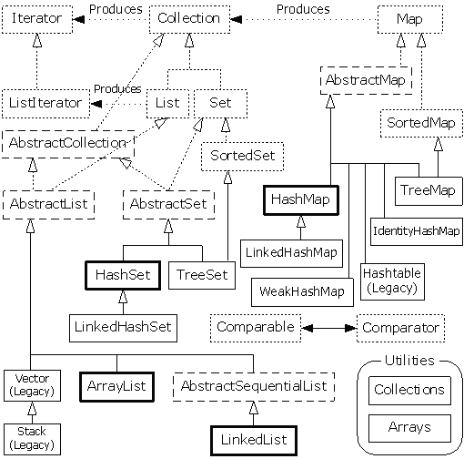
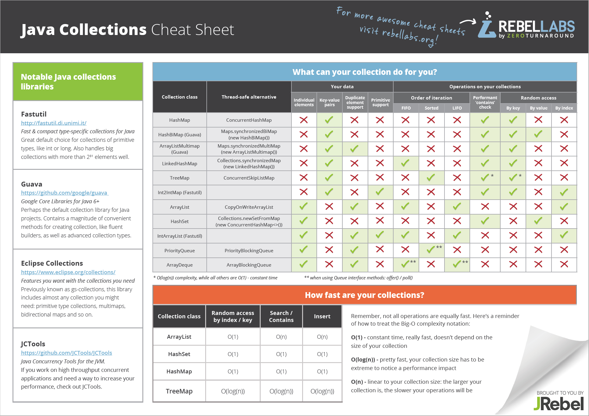

# 集合框架

在 Java 编程语言中，最基本的数据结构就两种，一个是数组，另外一个是模拟指针（引用）。总体来说，集合类可以分成两类，一类是 Collection，一类是 Map。Collection 又分为 Set、List、Queue、Stack 等。

## 概览

我们先来看下整个集合框架的拓扑图：

| Set、List、Map | Queue、Stack   |
| --------   | -----  |
|  |      |

## 有序性

一般而言，以 `Tree` 开头的集合类自动保持元素顺序，通过 `compareTo` 方法来确定元素顺序，底层红黑树存储；以Priority开头的集合类也是通过 `compareTo` 方法来确定元素优先级；以 `Linked` 开头的集合类保持插入顺序，底层链式存储。无序不重集合类是通过 `equals` 方法来识别元素，如果是基于散列的集合类，首先通过散列值即 `hashCode` 来判断相等性，再通过 `equals` 方法进行比较。

另外，`List` 类型的集合类，可以通过 `Collections.sort(List<T> list)` 方法，进行排序，这就要求该集合类的元素必须实现 `Comparable` 接口，或者也可以使用 `Collections.sort(List<T> list, Comparator<? super T> c)` 方法，这就要求，我们外部传入比较器。

## 线程安全

上面所列出的集合类都是只能工作于单线程环境下，如果在并发环境下，我们需要支持并发的集合类。Set、List、Map，以及 Queue 和 Stack 各自都有适用于并发环境的对应类。

| Set | List   | Map   | Queue、Stack   |
| --------   | -----  | -----  | -----  |
| `CopyOnWriteArraySet` `Collections.synchronizedSet(Set)` | `CopyOnWriteArrayList` `Collections.synchronizedList(List)` | `ConcurrentHashMap` `Collections.synchronizedMap(Map)` |   |

## 其它特性

**受检集合类**

`java.util.Collections` 提供了受检的集合类，即便客户端有意通过原生类型来破坏集合类正常工作，也不会起作用，这些受检集合类可以通过诸如 `checkedSet`、`checkedList`、`checkedMap` 等方法得到。

**只读集合类**

`java.util.Collections` 提供了只读的集合类，即便客户端不被允许修改（添加或删除）该集合类，这些只读集合类可以通过诸如 `unmodifiableSet`、`unmodifiableList`、`unmodifiableMap` 等方法得到。

**线程安全的包装类**

`java.util.Collections` 提供了把既有集合类转成线程安全的集合类的方法，这些线程安全的集合类可以通过诸如 `synchronizedSet`、`synchronizedList`、`synchronizedMap` 等方法得到。

**类型安全的异构容器**

针对集合类泛型化的限制，即只能有固定数目的类型参数，可以通过将类型参数放在键上而不是容器上来避开这一限制，即类型安全的异构容器。[注解](Annotation.md)（Annotation） 提供的很多 API 以及 EnumMap 的定义 `public class EnumMap<K extends Enum<K>, V> extends AbstractMap<K, V>` （EnumMap 就是一个类型安全的异构容器，更多细节，请查看[实例受控类](InstanceControlledClass.md)）就是其应用的实例，更多细节，请另行查看《EJ 2nd Edition》。

## 所谓的快速失败和安全失败

在使用迭代器遍历一个集合对象时，如果遍历过程中删除集合元素，则会抛出 `ConcurrentModificationException` 异常，这就是所谓的快速失败（Fail-fast）。这是因为迭代器在遍历的时候，会核查集合对象的元素个数，如果发生变化则抛出异常。所以，在遍历的时候应尽量避免对元素数目造成影响的改动，如必须要删除一个元素，则首先使用显式迭代器，然后用迭代器本身的方法进行操作，即 `Iterator.remove()`。`java.util` 包下的集合类都是快速失败机制的，不能再多线程环境下使用。

而所谓安全失败（Fail-safe）是指，在遍历集合对象时不是直接在原集合上遍历，而是先复制，再在复制的集合对象上进行遍历。所以不会造成不一致的冲突。J.U.C 包下的集合类都是安全失败机制的，可以在多线程下并发使用和修改。

## 速查表

| 接口        | 具体类   |  线程安全 | 是否有序 |允许空元素| 允许重复(equals return true) | 实现原理  | 注意事项 |
| --------   | -----  | ----  |----  |-------- |-------- |-------- |-------- |
| Set        |   HashSet   |   X   |   X   | Y |X  |  基于 `HashMap` 实现  ||
|           |   TreeSet   |   X   |  Y (比较排序) | X |  X   | 基于 `TreeMap` 实现  ||
|           |   LinkedHashSet   |   X   |  Y (插入顺序)  | Y | X  |  基于 `LinkedHashMap` 实现  ||
|           |   CopyOnWriteArraySet   |  Y   |  Y (插入顺序)   | Y | X  | 基于 `CopyOnWriteArrayList` 实现  | 同 `CopyOnWriteArrayList` |
|        |   Collections.synchronizedSet(Set)   |  Y  | 取决于被包装类   |  取决于被包装类  | X   |  通过 `synchronized (mutex){}` 同步互斥锁实现，读写都会阻塞  |  保证完全一致性，但性能受到影响   |
| List     | ArrayList |   X     |   Y (插入顺序)   | Y   |  Y  | 基于`数组`实现，扩容的时候会复制数组 | 适合随机访问以及追加元素，最好指定 `initialCapacity`，避免数组复制 |
|      | LinkedList |   X   |  Y (插入顺序)   |  Y    | Y  | 基于 `双向链表` 实现 | 适合新增和删除操作，也常当作队列来使用，需要在外部考虑同步；`LinkedList` 实现了 `Deque` 接口，因此 `LinkedList` 也可以当作栈来使用 |
|      | CopyOnWriteArrayList |   Y   |    Y (插入顺序)  | Y |  Y   |  基于数组实现，每次发生写操作的时候，都复制一个新的数组。写线程安全是通过 `ReentrantLock` 实现的。读写分离的思想，读和写分别操作的是不同的容器。  | 修改性能很差，多用于读的频率远大于写的频率的场景，保证最终一致性 |
|        |   Collections.synchronizedList(List)   |  Y  | Y (插入顺序)   |  Y  | Y   |  通过 `synchronized (mutex){}` 同步互斥锁实现，读写都会阻塞  |  保证完全一致性，但性能受到影响   |
| Map        |   HashMap   |  X  |   X   |  Y (key and value)  |  N/A  | 基于数组（AKA 哈希表，hash table of buckets）和链表的组合实现，`hashCode` 即数组下标，如果发生哈希碰撞（同一个 bucket），则通过`(单向)链表`或`红黑树`存放返回相同 `hashCode` 的元素；详见附注① |  循环遍历过程中，关于结构性的修改操作，需要通过 `iterator.remove` 来进行；一般不需要考虑自己设定 `initialCapacity`、`loadFactor` |
|        |   LinkedHashMap   |  X  |   Y (插入顺序)   |  Y (key and value)  | N/A | 基于 `HashMap` 和 `双向链表` 实现 | 同 `HashMap` |
|          |   IdentityHashMap   |  X  |  X   |  Y (key and value)  |  N/A  |  用 `==`(reference-equality)而不是 `equals`(object-equality)，比较 `key` 值；使用 `System.identityHashCode()` 而不是 `hashCode` | 很少用 |
|          |   TreeMap   |  X  |  Y (比较排序)   | X   | N/A   | 基于 `红黑树` 实现 |     |
|        |   ConcurrentHashMap(Hashtable)   |  Y  |  X  |   X  | N/A   |  通过非常细粒度（即将要修改的 bucket）的 `synchronized` 锁，也称作分段锁  |  读操作没有加锁因此也不会阻塞，有可能与另外线程的写操作同时发生，读到的不完整的数据，这里的一致性是**最终一致性**   |
|        |   Collections.synchronizedMap(Map)   |  Y  | 取决于被包装类   |  取决于被包装类   | N/A   |  通过 `synchronized (mutex){}` 同步互斥锁实现，读写都会阻塞  |  保证完全一致性，但性能受到影响   |
| Queue        |    ArrayQueue     |  X  |  Y (FIFO) | Y | Y | 同 `ArrayList` | 同 `ArrayList`，不算是真正的队列，不常用 |
|         |    PriorityQueue   |  X  |  Y (比较排序)  | X  | Y | 基于`数组`实现，扩容的时候会复制数组  | 非多线程环境的优先队列，最好指定 `initialCapacity`，避免数组复制  |
|         |    ArrayBlockingQueue    |  Y  |  Y (FIFO)   | X  | Y | 基于`数组`实现，不会自动扩容（有界），线程安全是通过 `ReentrantLock`（可以指定其为公平锁） 实现，通过 `Condition` 实现等待/阻塞（读取一个空队列，或者试图写入一个满队列） | 初始化的时候，必须指定 `capacity`；可能具有更高更稳定的性能  |
|          |    LinkedBlockingQueue    |  Y  |  Y (FIFO)   | X  | Y | 基于 `双向链表` 实现的可选有界队列，入队和出队分别是不同的 `ReentrantLock`，通过 `Condition` 实现等待/阻塞（读取一个空队列，或者试图写入一个满队列） | 具有更大的吞吐量，适合高并发环境  |
|        |    SynchronousQueue    |  Y  | N/A  | X | N/A  |  基于 `TransferQueue` 机制实现，入队操作必须等待出队操作，反之亦然，否则等待或者返回错误结果或者抛出异常；没有任何容量，不能存留任何元素，一个元素只有在被取走的时候才会被加入到队列里 | 很少用  |
|       |    PriorityBlockingQueue    |  Y  | Y (比较排序)    | X  | Y  | 类似 `PriorityQueue` 的无界阻塞队列，线程安全是通过 `ReentrantLock` 实现的 | 最好指定 `initialCapacity`，避免数组复制  |
|       |    ConcurrentLinkedQueue    |  Y  | Y (FIFO)    | X  | Y  | 基于 `CAS(Compare-and-Swap)` 原子指令和`（单向）链表`的无界非阻塞队列 |  批量操作（`addAll`、`removeAll` 等）不保证原子性，如果读（比如 `iterator` 操作）与写（比如 `addAll`）同时发生，可能读到不完整的数据，这里的一致性是最终一致性；另外，`CAS` 的 `ABA` 问题也值得关注；`size` 开销很大 |
|         |    LinkedTransferQueue    |  Y  |   Y (FIFO)  | X | Y  | 基于`（单向）链表`的无界阻塞队列；本质上是多了一项 `transfer()` 操作的 `BlockingQueue`，是 `ConcurrentLinkedQueue`、`SynchronousQueue`(公平模式)、无界的 `LinkedBlockingQueues` 等的超集  | 批量操作（`addAll`、`removeAll` 等）不保证原子性，如果读（比如 `iterator` 操作）与写（比如 `addAll`）同时发生，可能读到不完整的数据，这里的一致性是最终一致性；`size` 开销很大 |
|       |    DelayQueue   |  Y  |  Y (比较排序)    | X | Y |  基于 `PriorityQueue` 实现，无界阻塞队列，线程安全是通过 `ReentrantLock` 实现的；通过 `Condition` 等待 `Delayed` 元素到期，然后才能取走  |    |
|       |    ArrayDeque    |  X  |  Y (插入顺序)   | X  |  Y  | 基于`数组`实现的无界双向队列，扩容的时候会复制数组  | 可以作为栈使用，作为栈使用，比 `Stack` 更快，作为队列，比 `LinkedList` 更快 |
|       |    LinkedBlockingDeque    |  Y  |  Y (插入顺序)   | X |  Y | 基于`双向链表`实现的可选有界双向队列，入队和出队是一个 `ReentrantLock`，通过 `Condition` 实现等待/阻塞（读取一个空队列，或者试图写入一个满队列）  | 可以固定容量；可以作为栈使用  |
|       |    ConcurrentLinkedDeque    |  Y  |  Y (插入顺序)    | X  |   Y   |  基于 `CAS(Compare-and-Swap)` 原子指令和双向链表的无界非阻塞队列  |  批量操作（`addAll`、`removeAll` 等）不保证原子性，如果读（比如 `iterator` 操作）与写（比如 `addAll`）同时发生，可能读到不完整的数据，这里的一致性是最终一致性；`size` 开销很大  |
|   Stack    |   Stack   |  Y  | Y (LIFO)  | Y |  Y  | 对于 `Vector` 的简单封装  | 作为栈，应该优先使用 `{@link Deque}` 接口和其实现  |

### 附注

① `HashMap` 的底层结构：

② Notable Java collections libraries

