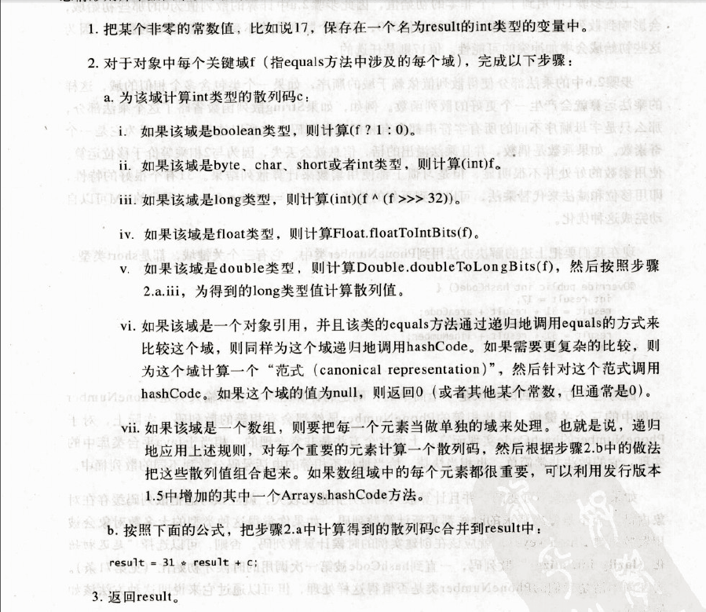

# 对象比较

对象比较涉及**二元全等（`equals`方法）比较**和**三元顺序比较（`compareTo`方法）**。equals是compareTo一个特例，一般情况，我们都需要保证`(x.compareTo(y) == 0) == (x.equals(y))`。

#### 全等比较

我们先来看equals比较。equals比较是作用于non-null对象上的等价性比较，类似布尔代数的逻辑等，必须满足以下**约定**：自反性、对称性、传递性、一致性，以及非空性，即对任何non-null对象x，`x.equals(null)`都应该返回`false`。默认情况下，Object对象提供的equals实现（对象等同），一个对象只跟自己相等，这已经可以满足大多数需求，只有需要提供额外的**逻辑相等**判断的时候，才需要们重新实现equals方法。

**注意**：对于枚举而言，Object的equals方法等同于逻辑意义上的equals方法，因此不需要为枚举重新实现equals方法。

这里有个问题，可以被描述成**我们无法在扩展可实例化的类的同时，既增加新的值组件（需要用于决定对象是否相等的值成员变量），同时又保留equals约定**。一个变通方案就是，用组合代替继承。更多细节，请查看《EJ 2nd Edition》第8条。

综合上述所有要求，我们可以遵循以下步骤来实现一个可用的equals方法：

1. 使用`==`操作符检查**参数是否为这个对象的引用**。如果是，则返回true。
2. 使用`instanceof`操作符检查**参数是否为正确的类型**。如果不是，则返回false。一般来说，所谓正确的类型是指equals方法所在的那个类。有些情况下，是该类所实现的某个接口，这样就意味着允许在实现了该接口的类之间进行比较。
3. 把参数转换成正确的类型。
4. 对于该类中的每个**特征域**（依业务逻辑而定），检查参数中的域是否与该对象中对应的域相匹配。如果测试全部成功，则返回true；否则返回false。

下面是一个重新实现了equals方法的例子：

```Java
public class GeomPoint {

    private int x;
    private int y;

    ... // Remainder omitted

    @Override
    public boolean equals(final Object obj) {
        if (this == obj) {
            return true;
        }
        if (!(obj instanceof GeomPoint)) {
            return false;
        }
        GeomPoint p = (GeomPoint) obj;
        if (x == p.x && y == p.y) {
            return true;
        }
        return false;
    }
}
```

对于对象引用，则需要非空判断：

```Java
(field == obj.field || (field != null && field.equals(obj.field)))
```

另外一件和重写equals非常相关的事情是，如果你要重写equals，你就需要重写hashCode方法。我们来看hashCode的通用约定，摘自Java API文档：

> + 在应用程序的执行期间，只要对象的equals方法的比较操作所用到的信息没有被修改，那么对这同一个对象多次调用，hashCode方法都必须始终如一地返回同一个整数。多次执行过程中，每次执行所返回的整数可以不一样。
> + 如果两个对象根据equals方法比较是相等的，那么调用这两个对象中任意一个对象的hashCode方法都必须产生同样的整数结果。
> + 如果两个对象根据equals方法比较是不相等的，那么调用这两个对象中任意一个对象的hashCode方法，则不一定产生不同的整数结果。但是给不相等的对象产生截然不同的整数结果，会提高hash table的性能。

真正把equals和hashCode绑定起来的是第2条。除了这个约定外，更深层次的意义在哪里呢？我们首先要明白hash code是干什么用的。在基于hash的数据结构（比如HashMap、HashSet等）中，hash code被用来索引hash bucket的位置。也就是说，**在hash数据结构的（代码）实现中，hashCode和equals共同标识一个对象，只有hashCode的返回值相等且equals比较也相等的情况下，才说明两个对象相等**。需要说明的是只有对象被用于基于hash的数据结构中时才需要保证这种约定，但一般我们都要确保equals和hashCode是一致的，即满足上述的三条约定。

接下来，我们看如何实现一个高效hashCode方法，一个好的hashCode方法尽可能为不相等的对象产生不相等的hash code。《EJ 2nd Edition》给出了一种简单的方案：

> 

依照上面的指示，我们为已经重写equals方法的GeomPoint类实现一个hashCode方法：

```Java
@Override
public int hashCode() {
    int result = 17;
    result = 31 * result + x;
    result = 31 * result + y;
    return result;
}
```

另外，对于不可变类的hash code，应该考虑把hash code缓存在对象内部，而不是每次调用hashCode方法的时候都重新计算。

## 顺序比较

除了全等比较，如果一个类的实例具有内在的顺序关系，则可以实现`Comparable<T>`接口，并实现其`compareTo`方法，从而进行顺序比较。类似全等比较，顺序比较也要遵守以下约定：自反性、对称性、传递性、一致性。注意，这里不要求非空性，根据compareTo的约定或声明（请查看API文档），可以抛出NPE，以及ClassCastException，所以我们没必要做**非空检测**和**instanceof测试**。同时，强烈推荐保证`(x.compareTo(y) == 0) == (x.equals(y))`。但是，也有不满足这一约定的情况，比如BigDecimal类，请查看[精密计算](PreciseCalculation.md)。由于上述约定，和全等比较一样，这里也有一个限制，即**无法在用新的值组件扩展可实例化的类时，同时保持comapreTo的约定**。同样的变通方案也是用组合代替继承（更多细节，请查看《EJ 2nd Edition》第8条）。

compareTo方法的通用约定还包括对返回值的通用约定，将该对象与指定的对象比较，当该对象小于、等于或大于被比较对象的时候，分别返回一个负整数、0或者正整数。如果由于指定对象的类型而无法与该对象进行比较，则抛出ClassCastException异常。注意，对于返回值并没有规定具体数值，而只对符号和类型进行了规定，这样就允许我们进行某些优化措施。

编写compareTo方法与编写equals方法相似，只不过不是等同性比较而是顺序比较。另外，由于compareTo的约定，我们不需要做非空测试和instanceof测试，也不需要参数类型检查和转换，也即不用显式检查参数的合法性，其已经隐含地包含在值组件的比较当中。

如果一个既定类并没有实现Comparable\<T>接口，而我们又需要对其实例进行比较，则可以通过`Comparator<T>`来完成同样的工作，比如`String`类自带的无序比较运算符`CASE_INSENSITIVE_ORDER`。

实现Comparable\<T>接口的意义在于，可以和依赖于比较关系的[集合框架](CollectionsFramework.md)协同使用，比如有序集合类TreeSet和TreeMap，以及工具类Collections和Arrays，这就好比前面提到的依赖于全等关系和hash code的集合框架必须和实现了良好的equals和hashCode方法的类协同工作一样。

## 数值比较

数值比较可以看作对象比较的一个特例。数值从表示法上，可以分为两类：一类是整型，一类是浮点型。整型数值，可以直接使用关系操作符`<`、`>`、`==`以及`!=`进行比较。但是，对浮点数则不适用，我们来看一个例子：

```Java
float a = Float.NaN, b = Float.NaN;

System.out.println(a == b); // 输出false
System.out.println(Float.compare(a, b)); // 输出0
```

对于浮点数，由于NaN等特殊数值的存在，对单浮点数我们要用`Float.compare`来比较，而对双浮点数，我们要用`Double.compare`来比较。但是，这并不意味着这种比较有多么精确，比如下面的例子：

```Java
float a = 0.09999999999999998f, b = 0.1f;
System.out.println(Float.compare(a, b)); // 输出0
```

所以，再次声明，如果要求数值的绝对精确，使用BigDecimal类。

## 其它

JDK为我们提供了一些out-of-box的用于数组和集合比较的方法。对于集合类，我们可以用`Collections.sort`来进行排序比较；对于数组我们可以用`Arrays.parallelSort`和`Arrays.equals`进行排序或比较。无论集合还是数组，如果元素是对象，该对象都需要实现了良好的compareTo和equals方法。

就这样。
