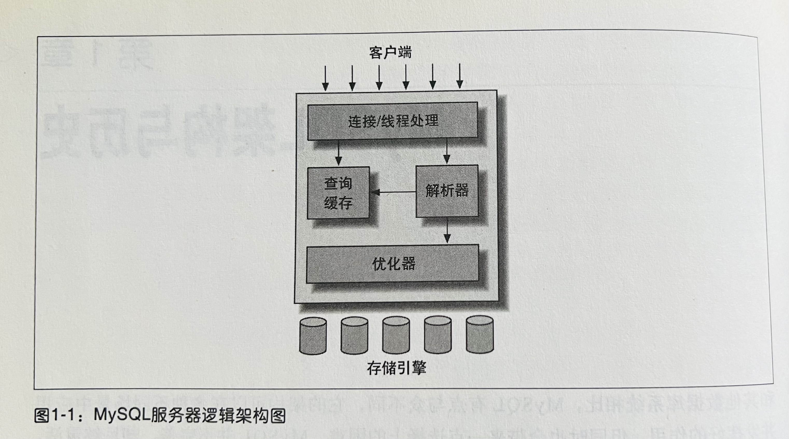

# MySQL

MySQL 是一个被普遍使用的关系型（SQL）数据库。其架构核心点在于"处理"（服务器）和"存储"的分离，这样可以按需替换不同存储引擎（比如，InnoDB 是 MySQL 默认的事务型引擎）。服务器和存储通过底层 API 交互。

每个客户端（应用）连接都会在服务器进程中占用一个线程。需要注意的是，服务器也会缓存线程，不会频繁的创建销毁线程。

InnoDB 也是通过 WAL（Write-Ahead Log）的方式进行写数据操作（[HBase](../BigData/TechItself-batch.md#hbase) 也是）。

后续所有讨论都基于 InnoDB 存储引擎。

## 并发控制

参阅[数据库编程的并发控制](../JavaSE/Java/Concurrency.md#数据库编程的并发控制)。

## 事务

事务具有四种属性（ACID）：①原子性/A、②一致性/C、③隔离性/I、④持久性/D。

事务并发的问题：

① 更新丢失（Lost Update）：两个并行操作，后进行的操作覆盖掉了先进行操作的操作结果，被称作更新丢失。

② 脏读：一个事务在提交之前，在事务过程中修改的数据，被其他事务读取到了。

③ 不可重复读：一个事务在提交之前，在事务过程中读取以前的数据却发现数据发生了改变。

④ 幻读：一个事务按照相同的条件重新读取以前检索过的数据时，却发现了其他事务插入的新数据。

对于上面这几个问题，更新丢失可以通过应用程序完全避免，而其他的问题则通过调整数据库**事务隔离级别**来解决，事务的隔离机制的实现手段之一就是利用**锁**。

### 隔离级别——③隔离性选择

隔离级别高意味着可靠性高，但并发量低，而隔离级别低则意味着可靠性低，但并发量高。事务的隔离级别有如下四种：

## 索引

**一级索引/主键索引**

一级索引也就是主键索引，MySQL 默认会为主键创建**聚簇索引**，叶子结点存储的是数据行。

注：一张表只能有一个聚簇索引。

**二级索引/辅助索引**

二级索引是用户通过 SQL 显式创建的索引。二级索引是非聚簇索引，叶子节点存储主键值（返回结果时，通过主键回表获取数据行）。

唯一组合键索引属于二级索引。

**覆盖索引**

如果一个索引包含（或者说覆盖/cover）所有需要查询的字段的值，我们就称之为**覆盖索引**。

**索引实现**

B-Tree/B+Tree 索引：适用于范围、多列组合查询（最左匹配）等。

Hash 索引：适用于等值查询，在有大量重复键值情况下，哈希索引的效率也是极低的，因为存在所谓的哈希碰撞问题。

> A unique constraint is a type of column restriction within a table, which dictates that all values in that column must be unique though may be null.

> To ensure that a column is UNIQUE and cannot contain null values, the column must be specified as NOT NULL.

> A unique constraint is defined at the time a table is created. A unique constraint allows null values. Initially, this may seem like a contradiction, but a null is the complete absence of a value (not a zero or space). Thus, it is not possible to say that the value in that null field is not unique, as nothing is stored in that field. A null value cannot be compared to an actual value. For example, the Queen of America cannot be compared to the Queen of England because the Queen of America is a null that does not exist.

## 优化

MySQL 服务器会对提交的的 SQL 进行优化。用户还可以通过 `hint` 提示服务器的优化策略，以及通过 `explain` 查看优化过程。

除了索引之外，服务器还支持查询缓存，通过缓存提高查询效率，但根据经验命中缓存的概率不高。

## 复制——高可用

一般一主库两从库一备库架构。主库负责写和事务内（或事务后亚秒范围内）查询，从库负责读（查询），从库辅助离线查询等。

## 扩展——分库分表

**分库分表**（sharding）是 MySQL 横向扩容的一种常见方式。

## ORM——SQL Mapper

ORM(Object-Relational Mapping) 允许通过 OOP 的方式访问关系型数据库。

**MyBatis - SQL Mapper Framework for Java**

略。
